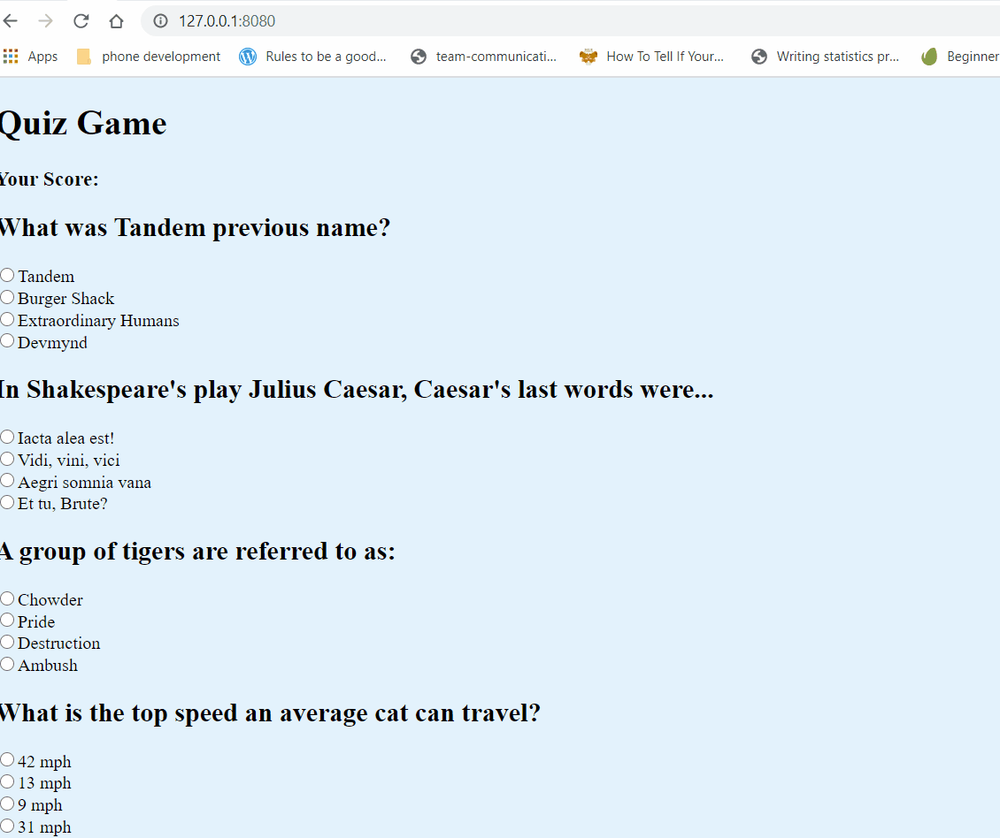

# ReadMe

## Tandem Code Challenge

It's trivia game night. Put on your thinking caps and flex your knowledge by taking this quiz.

You can play the game by following this [quiz game app link](https://lucid-shirley-4b9a5f.netlify.app/)

## How to run and install

1. Clone repo ``git clone git@github.com:zaynaib/devmynd_test.git``
2. Install npm dependencies ``npm install``
3. Navigate to **dist** run your development server. I prefer to use [live-server](https://www.npmjs.com/package/live-server)

## Project Requirements

* A user can view questions.
* Questions with their multiple choice options must be displayed one at a time.
* Questions should not repeat in a round.
* A user can select only 1 answer out of the 4 possible answers.
* The correct answer must be revealed after a user has submitted their answer
* A user can see the score they received at the end of the round

## Demo

## To Do  List:

- [x] Make sure user can click only on radio button at a time
- [ ] Add better css styles 
- [ ] Make sure game meets accessiblity standards
- [ ] Add noise file if user gets questions right or wrong 
